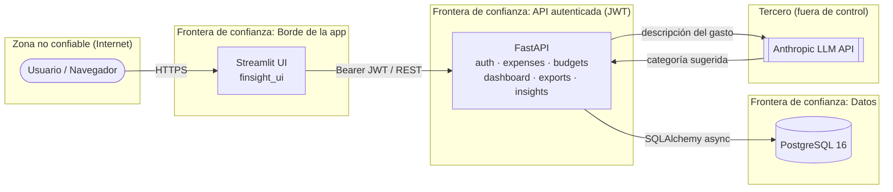
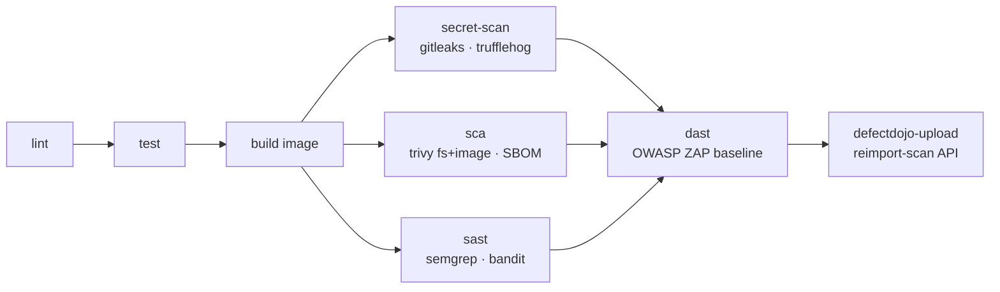

# Informe Final — Seguridad en DevOps (DevSecOps)

**Proyecto:** FinSight
**Curso:** DevOps — UTEC · Semana 16 · Valor: 30% de la nota final
**Equipo:** Lenin Chávez · Jerimy Sandoval · (tercer integrante)

> `⏳ TODO(evidence)` marca los puntos donde falta adjuntar capturas o reportes generados por las
> herramientas. El plan para producirlos está en [`pendientes.md`](./pendientes.md).

---

## 1. Título y descripción del proyecto

**FinSight** — gestor de finanzas personales *privacy-first* para LATAM con auto-categorización por IA.

Permite a una persona u hogar registrar gastos, agruparlos por categorías y presupuestos, ver un
dashboard mensual y exportar su información. La auto-categorización usa un modelo LLM (Anthropic) con
caché en base de datos. El diseño es *privacy-first*: **no** almacena credenciales bancarias ni se
conecta a bancos; el usuario es dueño de sus datos.

**Arquitectura (resumen):**

- **Frontend:** Streamlit (`frontend/src/finsight_ui`) — cliente HTTP contra el backend.
- **Backend:** FastAPI (`backend/src/finsight`) — módulos `auth`, `expenses`, `budgets`,
  `categories`, `households`, `dashboard`, `exports`, `insights`.
- **Base de datos:** PostgreSQL 16 (SQLAlchemy async + Alembic).
- **Autenticación:** JWT (python-jose) + bcrypt (12 rounds).
- **Servicio externo:** Anthropic LLM para categorización de gastos.
- **Infraestructura:** Docker Compose (db, web, ui, adminer). CI en GitHub Actions.

---

## 2. Diagrama de modelado de amenazas (STRIDE)

Diagrama de flujo de datos con fronteras de confianza (*trust boundaries*). Exportar a draw.io para
el enlace que exige la rúbrica.



**Elementos y categorías STRIDE asociadas:**

| Elemento | S | T | R | I | D | E |
|----------|---|---|---|---|---|---|
| Login / JWT (auth) | ✔ |   | ✔ |   |   | ✔ |
| Endpoints expenses/budgets |   | ✔ |   | ✔ |   | ✔ |
| Llamada al LLM (insights) |   |   |   | ✔ | ✔ |   |
| Exportación CSV (exports) |   |   |   | ✔ |   |   |
| API Gateway / FastAPI |   |   |   |   | ✔ |   |

S=Spoofing · T=Tampering · R=Repudiation · I=Information Disclosure · D=Denial of Service · E=Elevation of Privilege

> `⏳ TODO(evidence)`: rehacer este diagrama en **draw.io** y publicar el enlace.

---

## 3. Cinco vulnerabilidades principales (STRIDE)

| Threat Type | Componente | Descripción de la amenaza |
|-------------|------------|---------------------------|
| **Spoofing** | Login / JWT | Un atacante reutiliza un JWT robado o falsificado para suplantar a un usuario. El token incluye `jti`, pero **no existe lista de revocación**, por lo que un token filtrado sigue siendo válido hasta su expiración. La seguridad depende además de la fortaleza del `SECRET_KEY`. |
| **Tampering** | expenses / budgets | **Broken Object-Level Authorization (IDOR):** si los endpoints no validan que el recurso pertenece al `household` del usuario, un miembro puede leer o modificar gastos/presupuestos de otro hogar alterando el `id` en la petición. |
| **Information Disclosure** | insights (LLM) / exports | Las **descripciones de gastos (PII)** se envían a un tercero (Anthropic) para categorizar; ese dato sale del perímetro. Además, una exportación CSV mal autorizada podría filtrar gastos de otro hogar. |
| **Denial of Service** | FastAPI / LLM | **Sin rate limiting:** un atacante satura la API o abusa de la categorización por IA (cada gasto nuevo puede disparar una llamada al LLM), generando *cost-based DoS* y degradando la agregación del dashboard. |
| **Elevation of Privilege** | households (roles) / dependencias | Si faltan chequeos de rol, un `viewer` ejecuta acciones de `owner`/`contributor`. En paralelo, una **dependencia vulnerable** (p. ej. CVE en `python-jose`) puede abrir una ruta a ejecución de código y escalamiento. |

> **Repudiation (brecha identificada):** no hay *audit logging* de eventos de seguridad (logins,
> cambios de presupuesto), por lo que las acciones no son trazables ni atribuibles.

---

## 4. Elección de herramientas SAST y DAST

**SAST (análisis estático del código que escribimos):**
- **Semgrep** — reglas `p/ci`, `p/security-audit`, `p/python` (inyección SQL, XSS, funciones peligrosas, secretos hardcodeados).
- **Bandit** — analizador específico de Python (uso inseguro de `subprocess`, `pickle`, `assert`, etc.), complementa a Semgrep.

**DAST (análisis dinámico contra la app corriendo):**
- **OWASP ZAP** — *baseline scan* contra el contenedor del backend levantado en CI (cabeceras faltantes, endpoints expuestos, configuraciones inseguras).

**Justificación:** Semgrep + Bandit cubren el código fuente Python sin necesidad de ejecutarlo;
ZAP cubre el comportamiento en runtime que el análisis estático no ve. Las tres se integran como jobs
del pipeline de GitHub Actions (ver §9) y exportan reportes JSON que se centralizan en DefectDojo (§6).

> `⏳ TODO(evidence)`: capturas de los jobs `semgrep`, `bandit`, `zap-baseline` en verde + reportes
> `reports/semgrep-report.json`, `reports/bandit-report.json`, `reports/zap-report.json`.

---

## 5. Elección de herramientas de Secret Scanning y SCA

**Secret Scanning (credenciales filtradas):**
- **Gitleaks** — escaneo del repositorio e historial.
- **TruffleHog** — verificación de secretos (`--results=verified,unknown`).
- **Pre-commit** — `detect-private-key` ya presente; se agregan hooks de Gitleaks y TruffleHog como **primera barrera local** antes del push.

**SCA (Software Composition Analysis — dependencias):**
- **Trivy** — `filesystem` sobre las dependencias (`pyproject.toml`/lock) + escaneo de la **imagen Docker** + generación de **SBOM** (CycloneDX).
- Opcional: `pip-audit` para CVEs de paquetes Python.

**Doble barrera:** pre-commit bloquea localmente y el pipeline valida en CI; ningún secreto debería
llegar al repositorio remoto.

> `⏳ TODO(evidence)`: reportes `gitleaks-report.json`, `trufflehog-report.json`, `trivy-report.json`,
> `sbom.json` + captura de pre-commit bloqueando un secreto de prueba.

---

## 6. Centralización de vulnerabilidades en DefectDojo

**Enfoque:** desplegar **DefectDojo** localmente con Docker Compose y centralizar todos los hallazgos
de los escáneres en un único dashboard de deuda técnica de seguridad.

- **Despliegue:** `docker compose -f docker-compose.yml -f docker-compose.override.dev.yml up -d --build` (admin/admin con override dev), UI en `http://localhost:8080`.
- **Jerarquía:** Product Type (`Aplicaciones Web`) → Product (`FinSight`) → Engagement (`CI/CD`) → Tests.
- **Ingesta automática:** job de CI que llama al endpoint `POST /api/v2/reimport-scan/` (deduplica con `close_old_findings`), un upload por herramienta.
- **Tipos de scan (mapeo):**

  | Herramienta | `scan_type` en DefectDojo |
  |-------------|---------------------------|
  | Semgrep (`--json`) | `Semgrep JSON Report` |
  | Bandit | `Bandit Scan` |
  | Trivy (fs/imagen) | `Trivy Scan` |
  | Gitleaks | `Gitleaks Scan` |
  | TruffleHog | `Trufflehog Scan` |
  | OWASP ZAP | `ZAP Scan` |

- **Acceso desde runners de GitHub:** los runners alojados no alcanzan `localhost`; se expone
  DefectDojo con un túnel (**ngrok**) y se guardan `DEFECTDOJO_URL`, `DEFECTDOJO_TOKEN`,
  `DEFECTDOJO_PRODUCT_ID` como *secrets* del repositorio.

> `⏳ TODO(evidence)`: capturas de Products → FinSight (hallazgos por severidad/herramienta) y
> Metrics → Product Metrics.

---

## 7. Tabla de mitigaciones (hallazgos priorizados)

Borrador a partir del modelo STRIDE (§3) y los hallazgos esperados de los escáneres. Ajustar
severidades/IDs con los resultados reales tras ejecutar el pipeline.

| ID | Descripción del hallazgo | Severidad | Herramienta | Recomendación de mitigación |
|----|--------------------------|-----------|-------------|------------------------------|
| CRIT-001 | Posible CVE en dependencia transitiva (p. ej. `python-jose` / `cryptography`) con ruta a ejecución de código | CRITICAL | Trivy / pip-audit | Actualizar a versión segura; fijar versión en el lock; evaluar si es directa o transitiva. |
| HIGH-001 | Falta autorización a nivel de objeto (IDOR) en `expenses`/`budgets` entre hogares | HIGH | Semgrep + revisión manual | Validar `household_id` del recurso contra el usuario autenticado en cada endpoint. |
| HIGH-002 | JWT sin lista de revocación; token filtrado válido hasta expirar | HIGH | STRIDE / revisión | Implementar denylist por `jti` + refresh tokens y expiración corta. |
| MED-001 | PII (descripción de gasto) enviada a LLM de terceros sin minimización | MEDIUM | STRIDE / DAST | Minimizar/anonimizar el texto enviado; opt-in explícito; documentar en política de privacidad. |
| MED-002 | API sin rate limiting → DoS y abuso de costo del LLM | MEDIUM | OWASP ZAP / STRIDE | Agregar rate limiting (p. ej. SlowAPI) y *circuit breaker* en la llamada al LLM. |
| LOW-001 | Sin secret scanning en CI antes de este informe | LOW | Gitleaks / TruffleHog | Integrar Gitleaks + TruffleHog en pre-commit y pipeline (implementado en §9). |

---

## 8. Situación inicial vs. resultados

**Situación inicial (antes de DevSecOps):**
- CI con solo `lint` + `test` + validación de título de PR (GitHub Actions).
- Única medida de seguridad: hook `detect-private-key` y bcrypt/JWT en el código.
- Sin SAST, DAST, SCA, secret scanning ni gestión centralizada de vulnerabilidades.
- Vulnerabilidades **invisibles**: ninguna herramienta las detectaba ni las reportaba.

**Resultados (después de DevSecOps):**
- Pipeline con etapas de seguridad: secret scanning, SCA, SAST y DAST (§9).
- Hallazgos **centralizados en DefectDojo**, priorizados por severidad y deduplicados por pipeline.
- Doble barrera de secretos (pre-commit + CI).
- Trazabilidad de la postura de seguridad a lo largo del tiempo (Product Metrics).

> `⏳ TODO(evidence)`: cuadro comparativo con números reales (Nº de hallazgos por severidad antes/después,
> tiempo de detección, % de hallazgos mitigados).

---

## 9. Pipeline CI/CD completo

### 9.1 Diagrama del pipeline



### 9.2 Script del pipeline (borrador — `.github/workflows/security.yml`)

> Borrador para GitHub Actions adaptado de la plantilla GitLab de las guías UTEC. Pendiente de
> ejecutar y ajustar (ver `pendientes.md`).

```yaml
name: security

on:
  push:
    branches: [main, develop]
  pull_request:
    branches: [main, develop]

permissions:
  contents: read

jobs:
  secret-scan:
    runs-on: ubuntu-latest
    steps:
      - uses: actions/checkout@v4
        with:
          fetch-depth: 0
      - name: Gitleaks
        uses: gitleaks/gitleaks-action@v2
        env:
          GITLEAKS_VERSION: 8.27.2
      - name: TruffleHog
        uses: trufflesecurity/trufflehog@main
        with:
          extra_args: --results=verified,unknown

  sca:
    runs-on: ubuntu-latest
    steps:
      - uses: actions/checkout@v4
      - name: Trivy filesystem (deps)
        uses: aquasecurity/trivy-action@master
        with:
          scan-type: fs
          scan-ref: .
          format: json
          output: reports/trivy-report.json
          severity: HIGH,CRITICAL
      - name: Trivy SBOM (CycloneDX)
        uses: aquasecurity/trivy-action@master
        with:
          scan-type: fs
          scan-ref: .
          format: cyclonedx
          output: reports/sbom.json
      - uses: actions/upload-artifact@v4
        with:
          name: sca-reports
          path: reports/

  sast:
    runs-on: ubuntu-latest
    steps:
      - uses: actions/checkout@v4
      - name: Semgrep
        run: |
          pipx run semgrep ci \
            --config p/ci --config p/security-audit --config p/python \
            --json --output reports/semgrep-report.json || true
      - name: Bandit
        run: |
          pipx run bandit -r backend/src/finsight \
            -f json -o reports/bandit-report.json || true
      - uses: actions/upload-artifact@v4
        with:
          name: sast-reports
          path: reports/

  dast:
    runs-on: ubuntu-latest
    needs: [secret-scan, sca, sast]
    steps:
      - uses: actions/checkout@v4
      - name: Start app (docker compose)
        run: docker compose up -d --build web db
      - name: OWASP ZAP baseline
        uses: zaproxy/action-baseline@v0.12.0
        with:
          target: http://localhost:8000
          fail_action: false

  defectdojo-upload:
    runs-on: ubuntu-latest
    needs: [dast]
    if: ${{ secrets.DEFECTDOJO_URL != '' }}
    steps:
      - uses: actions/checkout@v4
      - uses: actions/download-artifact@v4
      - name: Upload reports to DefectDojo
        env:
          DEFECTDOJO_URL: ${{ secrets.DEFECTDOJO_URL }}
          DEFECTDOJO_TOKEN: ${{ secrets.DEFECTDOJO_TOKEN }}
          DEFECTDOJO_PRODUCT_ID: ${{ secrets.DEFECTDOJO_PRODUCT_ID }}
        run: |
          bash scripts/upload_to_defectdojo.sh "Semgrep JSON Report" reports/semgrep-report.json
          bash scripts/upload_to_defectdojo.sh "Bandit Scan"        reports/bandit-report.json
          bash scripts/upload_to_defectdojo.sh "Trivy Scan"         reports/trivy-report.json
          bash scripts/upload_to_defectdojo.sh "Gitleaks Scan"      reports/gitleaks-report.json
          bash scripts/upload_to_defectdojo.sh "ZAP Scan"           reports/zap-report.json
```

> Los jobs `lint` y `test` ya existen en `.github/workflows/ci.yml` y se mantienen.

---

## 10. Lecciones aprendidas (justificación del uso de DevOps)

1. **Problema de negocio:** FinSight maneja datos financieros personales (PII). Una filtración o un
   acceso indebido entre hogares destruye la propuesta *privacy-first* y la confianza del usuario.
2. **Qué limitaciones existían antes:** la seguridad dependía de revisión manual y de la disciplina
   individual; las vulnerabilidades eran invisibles hasta producción y no había forma de medir la
   postura de seguridad.
3. **Qué cambió con DevOps:** la seguridad se volvió *código* y parte del pipeline (shift-left).
   Cada push ejecuta SAST, DAST, SCA y secret scanning, y los hallazgos se centralizan automáticamente.
4. **Ventajas concretas obtenidas:** detección temprana y automática de CVEs y secretos; trazabilidad
   y priorización de hallazgos en DefectDojo; doble barrera contra secretos; un proceso repetible que
   no depende de que alguien "se acuerde" de revisar.

---

## 11. Recomendaciones para implementar DevOps en otros proyectos

1. **Empezar por *shift-left*:** integrar secret scanning y SCA primero — son baratos, rápidos y de alto impacto.
2. **Pre-commit + CI (doble barrera):** detener problemas antes del push y volver a validarlos en el pipeline.
3. **Centralizar hallazgos:** una herramienta como DefectDojo evita que los reportes se pierdan en logs de CI y permite priorizar por severidad.
4. **Modelar amenazas temprano (STRIDE):** dirige qué controles importan según el contexto del negocio.
5. **`allow_failure` al inicio, *gates* después:** dejar que los escáneres reporten sin romper el build al comienzo, y endurecer a *fail-on-finding* cuando el equipo madura.
6. **Tratar la seguridad como parte de la *Definition of Done*,** no como una fase aparte al final.
